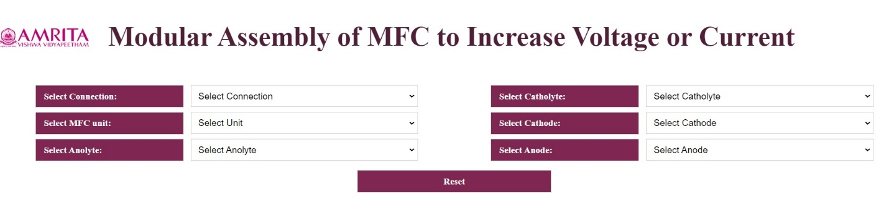
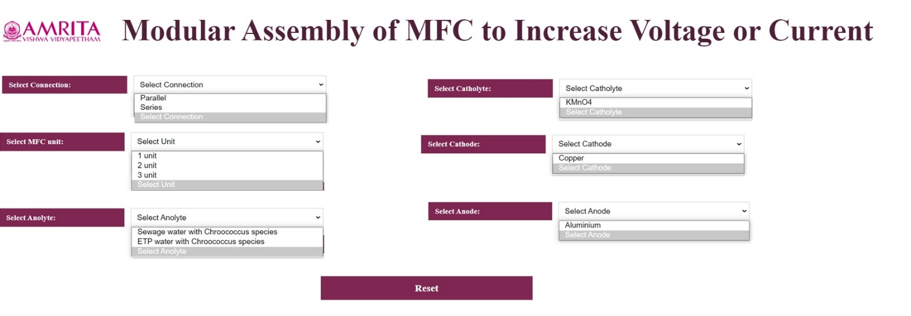
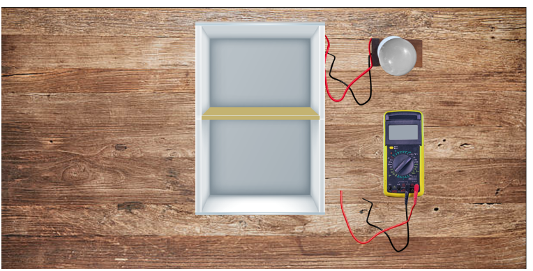
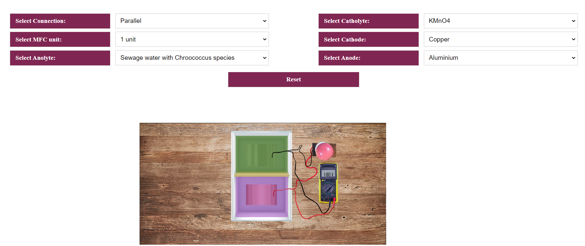
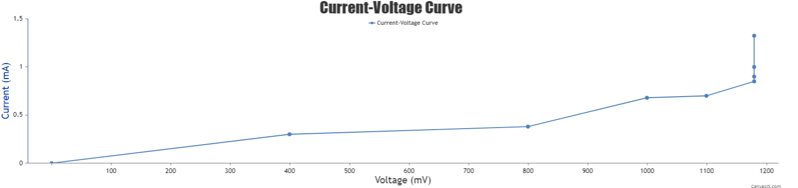
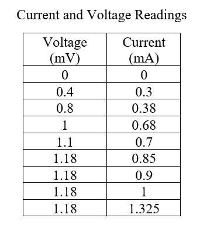

### Procedure

1.	Users can open the simulator window. The GUI has selection choices for input parameters such as  Select connection, Select MFC unit, Select anolyte, Select catholyte, Select cathode, Select anode, and a reset button.

&nbsp;
 
2.	Users need to select the parameters for working with the simulator. The options for connections are series and parallel connection, MFC unit can be either 1, 2, or 3 units, Anolyte can be either sewage with Chroococcus species or ETP with Chroococcus species. The Catholyte provided is KMO4, Cathode is Copper and Anode is Aluminium. 

&nbsp;
 
 
#### Parallel Connection

1.	Provide the connection as Parallel, select MFC unit as 1 unit, anolyte as sewage water with Chroococcus species, Catholyte as KMO4, Cathode as Copper and Anode as Aluminium. When connection is selected, the preview of 1 unit MFC is displayed in the GUI which has a cathodic chamber and anodic chamber separated by a PEM. 

&nbsp;
  

2.	When anolyte as sewage water with Chroococcus species is selected the MFC unit gets filled with sewage water. Similarly the catholyte, anode and cathode is gets added in the MFC chamber. 

&nbsp;
 
The connection will result in the production of bioelectricity which is represented by the glowing of the bulb attached to the system. The maximum voltage measurement is displayed in the attached multimeter. The maximum voltage produced is 1.180V

3.	At the same time IV Curve ( Voltage versus Current) is plotted in the GUI. The IV curve respresents voltage and current produced over a period of time.

&nbsp;
 
 
In parallel connection, the voltage remains constant after a period and current production increases subsequently.

&nbsp;
 

4.	Users can then click on Reset button to restart the simulator. Select the connection as Parallel, select MFC unit as 2-unit, anolyte as sewage water with Chroococcus species, Catholyte as KMO4, Cathode as Copper and Anode as Aluminium.  
At the same time IV Curve (Current Voltage curve) is plotted in the GUI.

 
The maximum voltage produced is 1.180V
Current and Voltage Readings
Voltage (mV)	Current
(mA)
0	0
0.4	0.62
0.8	0.78
1	1.4
1.1	1.56
1.18	1.72
1.18	1.86
1.18	2.06
1.18	2.68

5.	Users can then click on the Reset button to restart the simulator. Select the connection as Parallel, select MFC unit as 3-unit, anolyte as sewage water with Chroococcus species, Catholyte as KMO4, Cathode as Copper and Anode as Aluminium. 
 
At the same time IV Curve ( Voltage versus Current) is plotted in the GUI.

The maximum voltage produced is 1.180V

 

Current and Voltage Readings
Voltage (mV)	Current
(mA)
0	0
0.4	0.96
0.8	1.15
1	2.15
1.1	2.2
1.18	2.55
1.18	2.8
1.18	3.2
1.18	3.98

From the IV curve of 1 unit, 2 unit and 3-unit MFC, it is observed that voltage remains constant at a time and current increases. When MFC units are connected in parallel the resulting current is the cumulative of the current produced in 1-unit MFC. 
6.	Click on reset button to restart the experiment.
7.	Then, users can change the anolyte as ETP water with Chroococcus species and can change other parameters to study the changes in voltage and current production.

Voltage and Current readings of parallel connection of MFC with ETP with Chroococcus species as Anolyte
1 Unit	2 Unit	3 Unit
Voltage (mV)	Current
(mA)	Voltage
(mV)	Current
(mA)	Voltage
(mV)	Current
(mA)
0	0	0	0	0	0
0.2	0.28	0.2	0.58	0.2	0.8
0.4	0.49	0.4	1	0.4	1.5
0.6	0.68	0.6	1.34	0.6	2.04
0.8	0.85	0.8	1.6	0.8	2.5
1	0.9	1	1.85	1	2.81
1.08	0.95	1.08	1.9	1.08	2.85
1.08	0.98	1.08	1.92	1.08	2.9
1.08	1.05	1.08	2	1.08	3.1
1.08	1.098	1.08	2.198	1.08	3.29

Series Connection
1.	Provide the connection as Series, select MFC unit as 1 unit, anolyte as ETP water with Chroococcus species, Catholyte as KMO4, Cathode as Copper and Anode as Aluminium. When connection is selected, the preview of 1-unit MFC is displayed in the GUI which has a cathodic chamber and anodic chamber separated by a PEM. 
 

2.	When anolyte as ETP water with Chroococcus species is selected the MFC unit gets filled with ETP water . Similarly, the catholyte, anode and cathode gets added in the MFC chamber.
 
The maximum voltage measurement is displayed in the attached multimeter. The maximum voltage produced is 0.662V. The running of fan attached to the MFC system indicates the voltage and current production. 
At the same time IV Curve ( Current Voltage Curve) is plotted in the GUI.

 
In the series connection, the current remains constant after a period and voltage production increases subsequently.
 

Voltage and Current readings of series connection of MFC with ETP water with Chroococcus species as Anolyte
1 Unit	2 Unit	3 Unit
Voltage (mV)	Current
(mA)	Voltage
(mV)	Current
(mA)	Voltage
(mV)	Current
(mA)
0	0	0	0	0	0
100	0.28	200	0.28	300	0.28
200	0.47	400	0.47	600	0.47
300	0.8	600	0.8	900	0.8
400	1.12	800	1.12	1200	1.12
500	1.38	1000	1.38	1500	1.38
600	1.48	1200	1.48	1800	1.48
620	1.5	1240	1.5	1860	1.5
630	1.57	1260	1.57	1890	1.57
635	1.57	1270	1.57	1905	1.57
640	1.57	1280	1.57	1920	1.57
645	1.57	1290	1.57	1935	1.57
650	1.57	1300	1.57	1950	1.57
655	1.57	1310	1.57	1965	1.57
660	1.57	1320	1.57	1980	1.57
665	1.57	1330	1.57	1995	1.57

When MFC units are connected in series the resulting voltage is the cumulative of the voltage produced in 1-unit MFC. 
8.	Click on reset button to restart the experiment.
9.	Then, users can change the anolyte sewage water with Chroococcus species and can change other parameters to study the changes in voltage and current production
 

Voltage and Current readings of series connection of MFC with sewage water with Chroococcus species as Anolyte
1 Unit	2 Unit	3 Unit
Voltage (mV)	Current
(mA)	Voltage
(mV)	Current
(mA)	Voltage
(mV)	Current
(mA)
0
	0	0	0	0	0
100	1.08	200	1.08	300	1.08
200	1.2	400	1.2	600	1.2
300	1.3	600	1.3	900	1.3
400	1.8	800	1.8	1200	1.8
500	2	1000	2	1500	2
600	2.12	1200	2.12	1800	2.12
700	2.13	1400	2.13	2100	2.13
800	2.14	1600	2.14	2400	2.14
900	2.14	1800	2.14	2700	2.14
1000	2.14	2000	2.14	3000	2.14
1100	2.14	2200	2.14	3300	2.14

