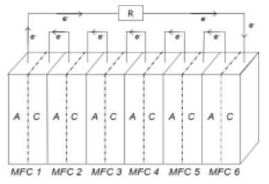
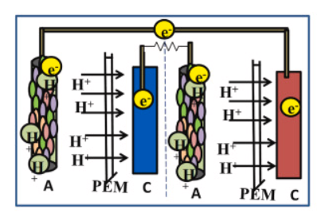
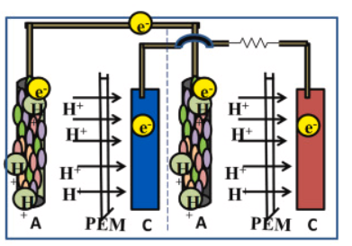

## Introduction

Microbial fuel cells (MFC) provide an alternative method for producing energy from waste products. Here, the organic matter is converted into electric current with the help of microorganisms as biocatalysts for the reaction. Even though MFC is considered a promising technology, high internal resistance, and low current production results in less economic feasibility. Typical MFCs include an anodic chamber and a cathodic chamber which is separated by a salt bridge or PEM.  The microorganism present in the substrate oxidizes the organic compounds and produces electrons and protons. The electrons produced move to the anode surface which is then transferred through the external circuit to produce electricity. The protons transfer through the proton exchange membrane (PEM) to the cathodic chamber where the proton, electron, and electron acceptor combine to produce water. The output current depends on the assembly of the components of the MFC, and research has been progressing to find alternative solutions for improving the productivity of MFC with effective electrode materials and robust microorganisms for full-scale application. 
&nbsp;

## Theory

There has been increased demand for alternative sustainable energy with less emission of greenhouse gases and the use of microbial fuel cells has boosted for maximum energy efficiency. As discussed in the previous experiments, a microbial fuel cell (MFC) is a promising renewable and sustainable new technology that converts the chemical energy resident in organic materials into electric energy mediated by microorganisms as biocatalysts for oxidizing the biodegradable substrate. A typical MFC consists of anodic and cathodic compartments separated by a cation (positively charged ion) specific membrane. The microorganisms in the anodic compartment of MFCs are exoelectrogenic in nature and generate electrons, protons, carbon dioxide, and other metabolic products by metabolizing organic matter. The electrons are transferred externally to the cathodic chamber with simultaneous production of electricity. The generated protons in the anodic compartment are transported to the cathodic chamber through the proton exchange membrane, and the protons and electrons in the cathodic chamber combine with oxygen to produce water molecules. 

The design and construction of a microbial fuel cell (MFC) involves a combination of techniques and principles of biology, electrochemistry, and engineering. There are certain parameters to be considered while constructing a microbial fuel cell. These include the effectiveness of proton exchange membrane (PEM), cell resistance, type of organic substrate, types of electrode materials, size, and connection of MFCs for scaling up the design with reduced fabrication cost. 
&nbsp;

## Modular Assembly of MFC

### 1.	Components of MFC

The type of material used for MFC design has a great impact on its performance. Generally, the MFC has an anode chamber and a cathode chamber, and the framework was constructed with specific non-reactive materials like acrylic, glass, or plastic which should be compatible with the other components of the MFC. 

#### Anode

The anode electrode works to transfer the electrons and protons, the common reactions occurring in the MFC. The chosen electrode material must be resistant to corrosion over time, biocompatible, have higher electrical conductance, be mechanically and chemically stable, be non-toxic, have a higher surface area, and have low operation cost. The anode electrode plays an important role in facilitating the transfer of electrons from the bacteria to the external circuit. The commonly used electrodes are carbon brushes, carbon rods, carbon mesh, carbon paper, graphite plate, carbon cloth, carbon felt, and Carbon Nanotubes (CNTs). In addition to carbon-based materials, other conductive materials such as stainless steel, gold, silver, copper, aluminium, nickel, and titanium also serve as electrode materials. The highly conductive materials function to increase MFC power efficiency. 

#### Cathode

The cathode electrode in a microbial fuel cell (MFC) functions to facilitate a reduction reaction thereby completing the electron transfer process initiated at the anode chamber. The cathode electrode acts as an electron acceptor for the MFC reactions. The electrode materials are usually the same as in the anode compartment. The commonly used electrodes are Carbon Cloth, Carbon Paper, Graphite Rods, carbon rods, carbon mesh, and in some cases, platinum-based materials are used as catalysts to improve MFC performance. 

#### Proton Exchange Membrane

The membrane is responsible for separating the anodic and cathodic chambers and allows the migration of protons (H⁺ ions) produced during microbial metabolism in the anode chamber to the cathode chamber. The direct contact between the anode and cathode electrodes was prevented to ensure electrochemical reactions on both sides increasing the MFC performance. PEM prevents electrolyte leakage between the chambers and crossover of gases between the anodic and cathodic chambers maintaining the anode as anaerobic and the cathode as aerobic favoring the microbial metabolism and contributing to MFC performance efficiency. Overall, PEM provides mechanical stability and integrity to MFCs. Commonly used PEM is perfluorinated sulfonic acid polymers such as Nafion but is expensive. Another option is to use Nutrient agar with Bacillus subtilis which also promotes efficient proton transfer between the chambers. 

### 2.	Design of MFC
MFCs are widely classified into different types depending on the number of chambers used: single-chambered fuel cell, double-chambered fuel cell, and stacked microbial fuel cell. In a single-chamber microbial fuel cell (both the anode and cathode compartments are combined into a single chamber, separated by a proton-exchange membrane (PEM) or some other ion-selective membrane. The advantage of using single-chamber MFC is low internal resistance and low construction cost. Gaseous crossover, microbial adulteration, and short circuits are likely to occur in single-chamber MFCs.  In double chambered fuel cell anode and cathode are constructed as two separate components separated by a proton-exchange membrane (PEM) or an ion-selective membrane separating them. The scalability of double-chamber microbial fuel cells due to the need for aeration requirements is a major drawback that needs to be stabilized for laboratory purposes. Stacked microbial fuel cells have been employed to improve power generation from MFC. Here, multiple MFC units in series or parallel are connected to increase power output.

This experiment delves into introducing the design features of a stacked microbial fuel cell.

### Stacked Microbial Fuel Cells

A stacked MFC includes a type of configuration where fuel cells are assembled to form a fuel cell battery by being stacked on one another in a series or parallel connection. 

### Series Connection

In the series connection of the stacked microbial fuel cell, individual cells (grids) in the system are connected in a series manner, so that the electrical output in one cell is connected to the electrical input of the next cell and so on (till the last cell of the system). This arrangement results in cumulative voltage generation across the stack (Fig.1). The individual MFC unit (1*1) in the system has an anodic chamber and a cathodic chamber separated by a proton exchange membrane (PEM). During construction, the anode of one unit is connected to the cathode of the next unit (Fig.2).  Electrons flow through each unit of MFC and this connection allows the voltage (electrical potential) of each MFC unit which can be measured by the multimeter while the current remains stable. While designing the series connection in MFC, it is important to consider factors such as the surface area of electrodes, microbial activity, and internal resistance for improving MFC performance.

Fig.1. Representation of connecting six individual MFC units in series; R, external resistance; A, anode; C, cathode

Adapted from: Yu, J.C. and Lee, T.H., 2009. Evaluation of Single and Stacked MFC Performances under Different Dissolved Oxygen Concentrations in Cathode Chamber. Journal of Korean Society of Environmental Engineers, 31(4), pp.249-255.

Fig 2. Serial connection of MFC

Adapted from: Mukherjee, A., Patel, V., Shah, M.T., Jadhav, D.A., Munshi, N.S., Chendake, A.D. and Pant, D., 2022. Effective power management system in stacked microbial fuel cells for onsite applications. Journal of Power Sources, 517, p.230684.

In brief, the series connection in a stacked microbial fuel cell results in the cumulative voltage production thereby increasing the overall electrical output of the MFC stack that enables higher power generation which would be applicable for various purposes.

### Parallel Connection

In the parallel connection of the stacked microbial fuel cell, the individual cells of the MFC are arranged parallelly so that the electrical outputs of the individual cells are connected at a constant voltage level. This arrangement results in the cumulative current generation across the stack. Here the anode of individual MFC units is connected and the cathodes of all units are connected together (Fig.3). When electrons start flowing through the MFC units, an electrical current is produced at each cell, and through parallel connection the current produced by each cell is added together to produce a cumulative current across the MFC system which can be measured by the multimeter connected to the system. The electrical power generation is high compared to the individual MFC operation separately. When higher currents are required, multiple units of MFC can be assembled parallelly to achieve the desired power generation. 
 

Fig.3. Parallel connection of MFC

Adapted from: Mukherjee, A., Patel, V., Shah, M.T., Jadhav, D.A., Munshi, N.S., Chendake, A.D. and Pant, D., 2022. Effective power management system in stacked microbial fuel cells for onsite applications. Journal of Power Sources, 517, p.230684.

### Applications of series and parallel connections in MFC

Both series and parallel connection in microbial fuel cells have a wider range of applications in various fields. Some examples included:

1.	In wastewater treatment plants for sensors, for equipment monitoring and to apply in small-scale electrical devices.

2.	In the bioremediation process, the higher voltages produced by the stack can be used to power pumps, mixers, or other equipment needed for the remediation process.

3.	In bioelectrochemical systems for driving the electrochemical processes necessary for biogas upgrading, desalination, and nutrient recovery.

The choice between series and parallel connection in a laboratory setting depends on specific outcomes, such as voltage or current output, scalability factors, and related system integration considerations.
